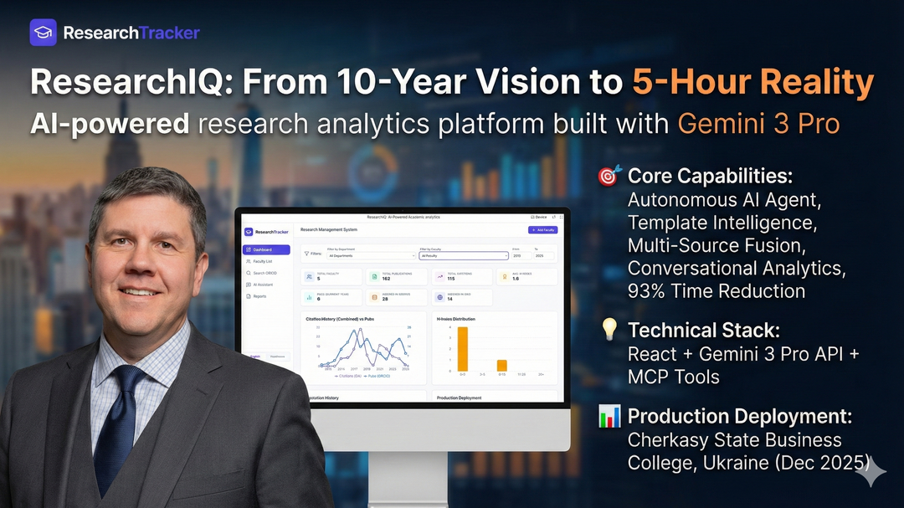
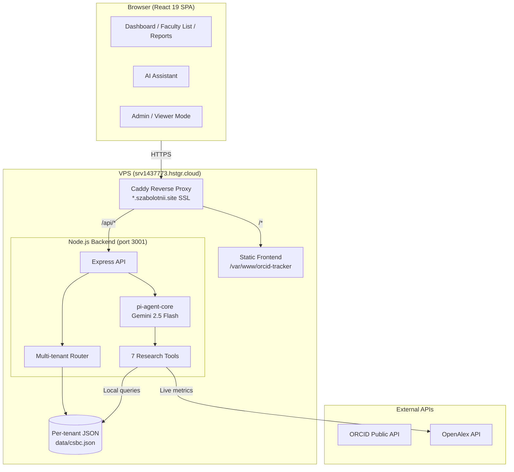
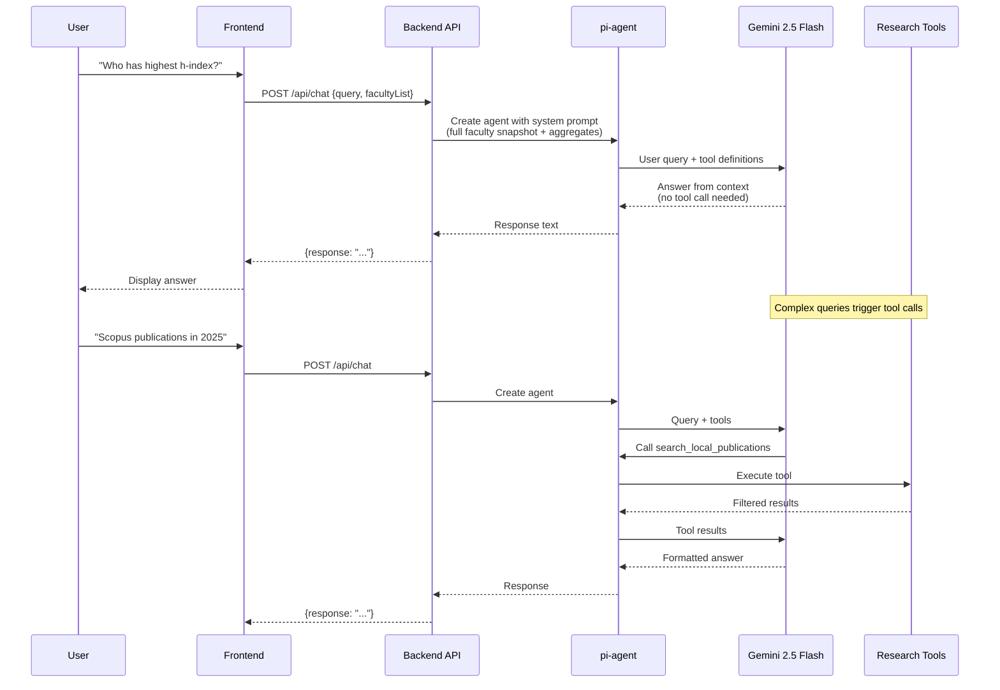
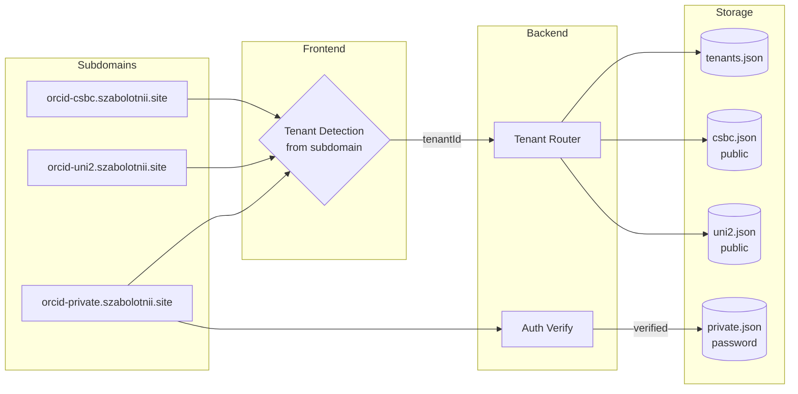

<div align="center">


# ResearchIQ: AI-Powered Academic Analytics

[](https://ai.google.dev/)
[](https://github.com/badlogic/pi-mono)
[](https://react.dev/)
[](https://www.typescriptlang.org/)
[](LICENSE)

**Multi-tenant research analytics platform** for university administrators.  
Aggregate faculty data from ORCID + OpenAlex, analyze with AI, generate ministry reports.

[**Live Demo**](https://orcid-csbc.szabolotnii.site) · [Report Bug](https://github.com/SZabolotnii/ORCID-OpenAlex-Research-Aggregator/issues)

</div>

---

## Problem

University administrators spend **40+ hours monthly** compiling research reports for accreditation and ministry requirements. Data is fragmented across ORCID, Scopus, Google Scholar, and institutional databases with manual copy-paste leading to errors.

## Solution

ResearchIQ automates the entire workflow:

1. **Import** faculty via CSV with ORCID IDs
2. **Aggregate** publications and metrics from ORCID + OpenAlex
3. **Analyze** with AI agent that has full access to institutional data
4. **Generate** standardized reports from templates

---

## Architecture

### System Overview



### AI Agent Architecture

The AI assistant is powered by [pi-agent-core](https://github.com/badlogic/pi-mono) — a minimal, extensible agent runtime by Mario Zechner. See [docs/pi-agent.md](docs/pi-agent.md) for details.



### Multi-tenant Data Flow



### Key Features

| Feature | Description |
|---------|-------------|
| **AI Research Assistant** | 7 tools: faculty rankings, publication search, department comparison, faculty detail, live OpenAlex metrics, global search, date |
| **Multi-tenant** | Each institution gets `orcid-{id}.szabolotnii.site` with separate data and access control |
| **Admin/Viewer modes** | Admin: full CRUD, import/export, settings. Viewer: read-only dashboard + AI + reports |
| **Batch Import** | CSV import with automatic ORCID + OpenAlex data fetching |
| **Report Generator** | Standard reports (Scopus/WoS, faculty card, accreditation) + custom template filling |
| **Bilingual** | English / Ukrainian interface |

### AI Agent — pi-agent-core

The backend uses [pi-agent-core](https://github.com/badlogic/pi-mono) (MIT, by Mario Zechner) as the agent runtime. It provides the tool execution loop, parallel tool calls, and streaming — while we define custom research tools and system prompt. The agent receives a **full faculty data snapshot** in the system prompt, so most questions are answered instantly from context without tool calls. For complex queries (filtering, ranking, full publication lists), the agent calls one of 7 custom tools that operate on local data. External API calls (OpenAlex) are used only when fresh data is needed.

> See [docs/pi-agent.md](docs/pi-agent.md) for detailed documentation on agent configuration, tools, and system prompt design.

### Tech Stack

| Layer | Technologies |
|-------|-------------|
| **Frontend** | React 19, TypeScript, Vite, TailwindCSS, Recharts |
| **Backend** | Node.js, Express, pi-agent-core, pi-ai (Gemini) |
| **Data Sources** | ORCID Public API, OpenAlex API |
| **Deployment** | VPS, PM2, Caddy (reverse proxy + SSL) |

---

## Quick Start

### Prerequisites

- **Node.js** 20+ ([Download](https://nodejs.org/))
- **Gemini API Key** ([Get Free Key](https://aistudio.google.com/apikey))

### Local Development

```bash
# 1. Clone
git clone https://github.com/SZabolotnii/ORCID-OpenAlex-Research-Aggregator.git
cd ORCID-OpenAlex-Research-Aggregator

# 2. Frontend
npm install

# 3. Backend
cd server && npm install && cd ..

# 4. Configure
echo "GEMINI_API_KEY=your_key_here" > .env
echo "GEMINI_API_KEY=your_key_here" > server/.env

# 5. Start both servers
cd server && npm run dev &
npm run dev
```

Frontend: [http://localhost:3000](http://localhost:3000) (proxies `/api` to backend at :3001)

### Import Faculty Data

```bash
# From CSV file (one ORCID per line, optional: department, position columns)
npx tsx scripts/import-csv.ts faculty.csv \
  --tenant csbc \
  --institution "University Name" \
  --output backup.json

# Options:
#   --site <url>          Target site (default: https://orcid-tracker.szabolotnii.site)
#   --tenant <id>         Tenant ID (default: "default")
#   --institution <name>  Default institution name
#   --department <name>   Default department
#   --position <name>     Default position (default: Associate Professor)
#   --output <file>       Also save JSON locally
#   --dry-run             Fetch data without uploading
```

---

## Project Structure

```
researchiq/
├── App.tsx                  # Main app: routing, state, admin/viewer modes, tenant detection
├── components/
│   ├── Dashboard.tsx        # Analytics dashboard with charts and filters
│   ├── FacultyList.tsx      # Faculty table (admin: edit/delete, viewer: read-only)
│   ├── ChatInterface.tsx    # AI assistant UI
│   ├── ReportGenerator.tsx  # Report generation with template upload
│   ├── OrcidSearch.tsx      # ORCID affiliation search (admin only)
│   └── ProfileModal.tsx     # Faculty detail view
├── services/
│   ├── geminiService.ts     # Chat → /api/chat backend; Reports → direct Gemini
│   ├── orcidService.ts      # ORCID Public API
│   ├── openAlexService.ts   # OpenAlex API (metrics, works)
│   └── dataMergeService.ts  # Publication deduplication
├── server/                  # Backend (separate package)
│   └── src/
│       ├── index.ts         # Express API: tenants, data, chat
│       ├── agent.ts         # pi-agent config, system prompt, context builder
│       ├── tools.ts         # 7 research tool implementations
│       └── types.ts         # Shared types
├── scripts/
│   └── import-csv.ts        # CLI data import tool
├── contexts/                # LanguageContext (EN/UA)
├── utils/translations.ts    # Bilingual translations
├── types.ts                 # Frontend TypeScript types
└── vite.config.ts           # Vite config with /api proxy
```

---

## Multi-tenant Setup

Each institution gets a subdomain following the pattern `orcid-{id}.szabolotnii.site`:

```bash
# 1. Add DNS A-record: orcid-{id}.szabolotnii.site → VPS IP
# 2. Add subdomain to Caddy config
# 3. Import data:
npx tsx scripts/import-csv.ts faculty.csv --tenant {id} --institution "Name"
```

Tenant configuration stored in `data/tenants.json`:
```json
[{
  "id": "csbc",
  "subdomain": "orcid-csbc",
  "name": "Cherkasy State Business College",
  "public": true,
  "adminPasswordHash": ""
}]
```

- `public: true` — dashboard visible to everyone, admin mode requires password
- `public: false` — entire dashboard requires password to view

---

## Deployment

### VPS Deployment (Current)

```bash
# Backend
scp -r server/src/* root@server:/opt/orcid-tracker-api/src/
ssh root@server "cd /opt/orcid-tracker-api && npx tsc && pm2 restart orcid-api"

# Frontend
npm run build
scp -r dist/* root@server:/var/www/orcid-tracker/
```

### Caddy Configuration

```caddyfile
orcid-tracker.szabolotnii.site, orcid-csbc.szabolotnii.site {
  handle /api/* {
    reverse_proxy 172.18.0.1:3001
  }
  handle {
    reverse_proxy orcid-tracker:80
  }
}
```

---

## License

MIT License - see [LICENSE](LICENSE) file.

---

## Contact

**Serhii Zabolotnii**  
Professor, Cherkasy State Business College

[](https://www.linkedin.com/in/serhii-zabolotnii-45a95432/)
