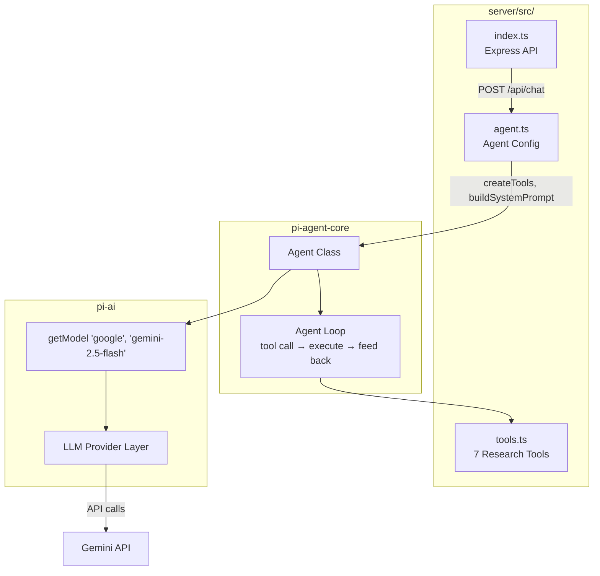
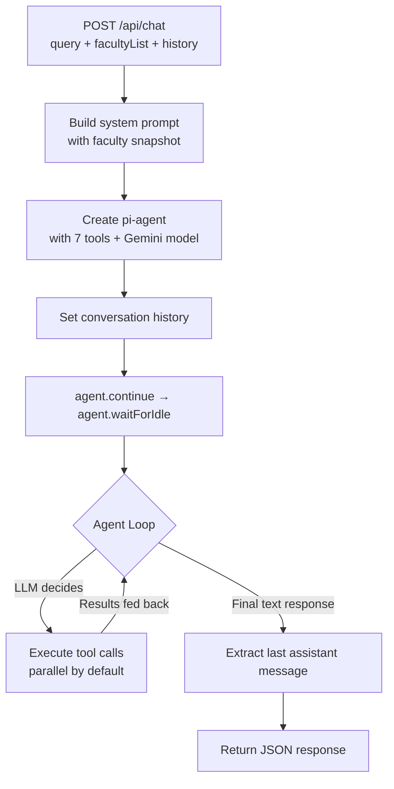

# PI-Agent Integration in ResearchIQ

## What is pi-agent?

[Pi](https://github.com/badlogic/pi-mono) is a minimal, extensible agent framework created by [Mario Zechner](https://github.com/badlogic). It consists of several packages:

| Package | Purpose | Used in ResearchIQ |
|---------|---------|-------------------|
| `pi-ai` | Unified LLM API layer (20+ providers) | Yes — Gemini model access |
| `pi-agent-core` | Agent runtime (tool loop, state management) | Yes — agent execution |
| `pi-coding-agent` | Interactive CLI coding assistant | No |
| `pi-web-ui` | Chat UI web components | No |

We use only the **core runtime** (`pi-agent-core` + `pi-ai`) — not the full CLI or web UI — and configure it with custom research tools and a domain-specific system prompt.

### Why pi-agent?

| Criteria | pi-agent | Direct Gemini SDK |
|----------|----------|-------------------|
| Tool execution loop | Built-in with parallel execution | Manual implementation |
| Multi-LLM support | 20+ providers (swap Gemini for Claude with one line) | Gemini only |
| Context management | Auto-compaction, streaming, abort signals | Manual |
| Tool validation | TypeBox schemas with runtime validation | Manual JSON Schema |
| Error handling | Structured error propagation | Manual try/catch |

## Architecture in ResearchIQ



## System Prompt Design

The system prompt (`server/src/agent.ts :: buildSystemPrompt()`) is the key to agent performance. It follows a **context stuffing** strategy — instead of forcing the LLM to call tools for every question, we embed a compact snapshot of all faculty data directly in the prompt.

### Prompt Structure

```
1. ROLE DEFINITION
   "You are ResearchIQ, an intelligent research analytics assistant
    for university administration at {institution}."

2. CURRENT DATE
   "TODAY'S DATE: 2026-04-22"

3. CAPABILITIES (3 tiers)
   - Instant answers from embedded data
   - Local query tools for complex filtering
   - External tools for fresh/global data

4. DECISION RULES
   - Rankings/comparisons → answer from data or use tools
   - Publication search → search_local_publications
   - Full profile → get_faculty_detail
   - Global trends → search_global_works (external)
   - NEVER loop get_author_metrics_live for multiple faculty

5. RESPONSE RULES
   - Language, Markdown tables, precision, actionable insights

6. FACULTY DATA SNAPSHOT
   Compact JSON array with per-faculty:
   - name, orcid, position, department, institution
   - pub counts (total, scopus, wos, oa)
   - metrics (h-index, i10, citations, 2yr citations)
   - top 3 topics
   - yearly pub/citation counts (last 5 years)
   - 10 most recent publications (title, year, sources, citations)

7. AGGREGATE STATISTICS
   Pre-computed per-department:
   - member count, total pubs, scopus/wos counts
   - average h-index, total citations
```

### Token Budget

| Data Level | 35 faculty | 50 faculty (est.) |
|-----------|-----------|-------------------|
| Compact summary (no pub titles) | ~2,200 tokens | ~3,200 tokens |
| + Recent publications | ~10,300 tokens | ~15,000 tokens |
| Gemini 2.5 Flash context | 1,048,576 tokens | - |

Even the richest representation uses under 2% of the context window.

### Why Context Stuffing?

1. **Speed**: Most questions answered in a single LLM call (no tool round-trips)
2. **Accuracy**: LLM reads exact numbers instead of computing from tool outputs
3. **Reduced errors**: Pre-computed aggregates prevent arithmetic mistakes
4. **Lower latency**: Tool calls add 1-3 seconds each; context-based answers are instant

## Custom Research Tools

All tools are defined in `server/src/tools.ts` using TypeBox schemas and implemented as pure functions that operate on the `facultyList` passed from the frontend.

### Tool 1: `query_faculty_rankings`

Rank and sort faculty by any metric.

**Parameters:**

| Param | Type | Description |
|-------|------|-------------|
| `metric` | string | `hIndex`, `citations`, `pubCount`, `scopusCount`, `wosCount`, `i10Index`, `citations2Year` |
| `department` | string? | Filter by department name |
| `limit` | number? | Max results (default: 10) |
| `order` | string? | `desc` (default) or `asc` |

**Example queries:**
- "Who has the highest H-index?"
- "Top 5 most cited faculty in Computer Science"
- "Faculty with fewest publications"

### Tool 2: `search_local_publications`

Search and filter publications across all loaded faculty.

**Parameters:**

| Param | Type | Description |
|-------|------|-------------|
| `query` | string? | Text search in title |
| `year` | number? | Exact year |
| `yearFrom` / `yearTo` | number? | Year range |
| `source` | string? | `scopus`, `wos`, `openalex`, `orcid` |
| `department` | string? | Filter by department |
| `authorName` | string? | Filter by author name (substring) |
| `limit` | number? | Max results (default: 20) |

**Example queries:**
- "Who published in 2025?"
- "Scopus articles in CS department"
- "Open access publications about machine learning"

### Tool 3: `get_department_comparison`

Compare all departments across multiple metrics.

**Parameters:**

| Param | Type | Description |
|-------|------|-------------|
| `metrics` | string[]? | Metrics to include (default: all) |

**Returns:** Table with memberCount, totalPubs, scopusPubs, wosPubs, oaPubs, avgHIndex, totalCitations per department.

### Tool 4: `get_faculty_detail`

Get complete profile of a specific faculty member.

**Parameters:**

| Param | Type | Description |
|-------|------|-------------|
| `nameOrOrcid` | string | Name (partial, case-insensitive, Latin/Cyrillic) or exact ORCID |

**Returns:** Full profile with all publications, metrics, topics, yearly stats.

### Tool 5: `get_author_metrics_live`

Fetch fresh metrics from OpenAlex API for a specific researcher.

**Parameters:**

| Param | Type | Description |
|-------|------|-------------|
| `orcid` | string | ORCID ID |

**Use case:** Only when local data is stale or missing metrics. System prompt explicitly forbids calling this in a loop.

### Tool 6: `search_global_works`

Search OpenAlex globally for papers by keyword.

**Parameters:**

| Param | Type | Description |
|-------|------|-------------|
| `query` | string | Search keywords |
| `year` | number? | Filter by year |

**Returns:** Top 5 papers by citation count.

### Tool 7: `get_current_date`

Returns current date in ISO format. No parameters.

## Agent Execution Flow



## Configuration Reference

### Creating the Agent (`server/src/agent.ts`)

```typescript
import { Agent } from "@mariozechner/pi-agent-core";
import { getModel } from "@mariozechner/pi-ai";

const agent = new Agent({
  initialState: {
    systemPrompt: buildSystemPrompt(facultyList, lang),
    model: getModel("google", "gemini-2.5-flash"),
    thinkingLevel: "off",
    messages: [],
    tools: createTools(facultyList),
  },
  getApiKey: () => process.env.GEMINI_API_KEY,
});
```

### Defining a Tool

```typescript
import { Type } from "@sinclair/typebox";
import type { AgentTool } from "@mariozechner/pi-agent-core";

const myTool: AgentTool<typeof schema, null> = {
  name: "tool_name",
  description: "What it does — used by LLM to decide when to call it",
  label: "UI Label",
  parameters: Type.Object({
    param1: Type.String({ description: "..." }),
    param2: Type.Optional(Type.Number({ description: "..." })),
  }),
  async execute(_toolCallId, params) {
    const result = doSomething(params);
    return {
      content: [{ type: "text", text: JSON.stringify(result) }],
      details: null,
    };
  },
};
```

### Switching LLM Provider

To use Claude instead of Gemini, change one line:

```typescript
// Gemini
const model = getModel("google", "gemini-2.5-flash");

// Claude
const model = getModel("anthropic", "claude-sonnet-4-5-20250929");

// OpenAI
const model = getModel("openai", "gpt-4o");
```

All 20+ providers supported by pi-ai work out of the box. Set the corresponding API key in the environment.

## Performance Characteristics

| Metric | Value | Notes |
|--------|-------|-------|
| Context-only response | ~2-4s | No tool calls needed |
| Single tool call | ~4-7s | One round-trip to LLM |
| Multiple tool calls | ~5-10s | Tools execute in parallel |
| Max tool turns | Unlimited* | pi-agent has no hard limit (unlike our old 5-turn client-side loop) |
| System prompt size | ~10K tokens | For 35 faculty with recent pubs |

## References

- [pi-mono repository](https://github.com/badlogic/pi-mono) — Source code
- [pi-ai: Unified LLM API](https://github.com/badlogic/pi-mono/tree/main/packages/ai) — Multi-provider support
- [pi-agent-core](https://github.com/badlogic/pi-mono/tree/main/packages/agent-core) — Agent runtime
- [TypeBox](https://github.com/sinclairzx81/typebox) — JSON Schema type builder for tool parameters
